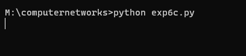
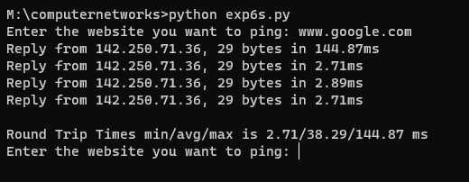

# EX-6 IMPLEMENTATION OF PING COMMAND

DATE :

## AIM :
To write the python program for simulating ping command.


## ALGORITHM :

1. Start the program.
2. Include the necessary package in Java.
3. Create a process object p to implement the ping command.
4. Declare a BufferedReader stream class object.
5. Get the details of the server:
  5.1. Obtain the length of the IP address.
  5.2. Determine the time required to get the details.
  5.3. Calculate the number of sent packets, received packets, and lost packets.
  5.4. Calculate the minimum, maximum, and average times.
6. Print the results.
7. Stop the program.
## PROGRAM :
### Client.py
```
import socket
from pythonping import ping

s = socket.socket()
s.bind(('localhost', 8000))
s.listen(5)
c, addr = s.accept()

while True:
    hostname = c.recv(1024).decode()
    try:
        c.send(str(ping(hostname, verbose=False)).encode())
    except KeyError:
        c.send("Not Found".encode())

```
### Server.py
```
import socket

s = socket.socket()
s.connect(('localhost', 8000))

while True:
    ip = input("Enter the website you want to ping: ")
    s.send(ip.encode())
    print(s.recv(1024).decode())
```

## OUTPUT :

## Client

## Server


## RESULT :
Thus, the python program for simulating ping command was successfully executed
